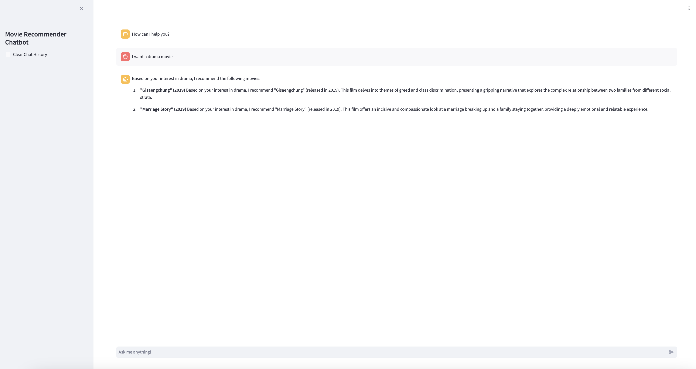

# Movie Recommender Chatbot
Movie recommender chatbot using FastAPI, Streamlit, LangChain and semantic-router with FAISS RAG.



## How to Run it 🛫

Navigate to the project directory
1. 
``` sh
cd movie-recommender-chatbot
```

2. Create `.env` file and add these keys
``` sh
OPENAI_API_KEY={OPENAI_API_KEY}
RETRIEVER_EMBEDDING_MODEL=text-embedding-3-small
OPENAI_TIMEOUT=30
OPENAI_TEMPERATURE=0.3
OPENAI_MODEL_NAME=gpt-4o
RETRIEVER_EMBEDDING_THRESHOLD=0.4
```


### Run - with Docker 🐳
```sh
docker-compose up --build
```

### Run - locally 💻 
### Backend
1. Make sure you have `Poetry` innstalled in your enviornment
```sh
pip install poetry
```
2. Navigate to the backed directory 
``` sh
cd components/backend
```
3. Install dependencies
```sh
poetry shell
poetry install
```
4. Run the app
```sh
 cd src/
 uvicorn app:app --host 0.0.0.0 --port 8080
```

### Frontend
1. Navigate to the backed directory 
``` sh
cd components/frontend
```

2. Install dependencies
```sh
poetry shell
poetry install
```

3. Run the frontend (optional)
> Make sure you are in the right dir `frontend`
```sh
streamlit run src/app.py --server.port 8081 --server.address 0.0.0.0
```

## APIs
- **URL**: `/chat`
- **Method**: `POST`
- **Description**: stream the chatbot response to the user
- **Request Body**:

```
{
    "message": "hello",
    "clear_history": false
}
```
- **Success Response**:

- **Response Type**: `text/event-stream`
- **Code**: `200 OK`
- **Content**:

  ```
    data: {"streamed_text": "Hello! I'm here to help you find the perfect movie to watch. ", "is_final": false}

    data: {"streamed_text": "Could you tell me a bit about what you're in the mood for? ", "is_final": false}

    data: {"streamed_text": "Are there any specific themes, settings, or favorite movies you'd like me to consider for my recommendations?", "is_final": true}

  ```


